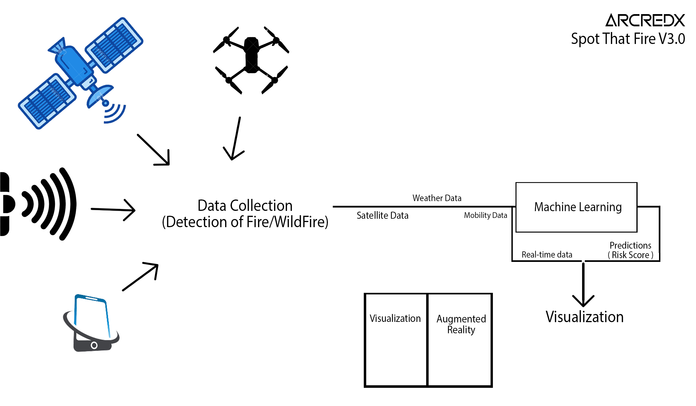
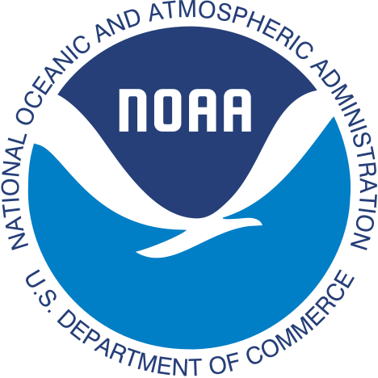
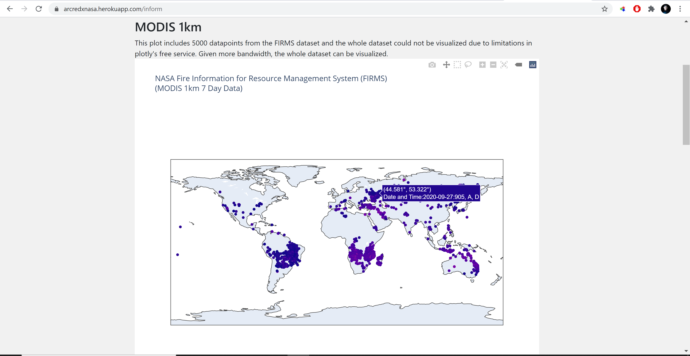
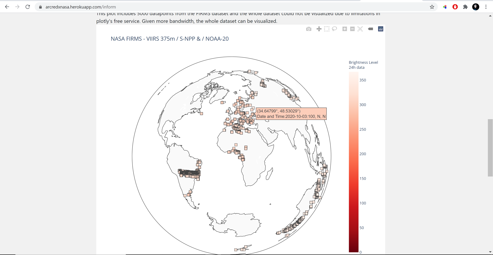
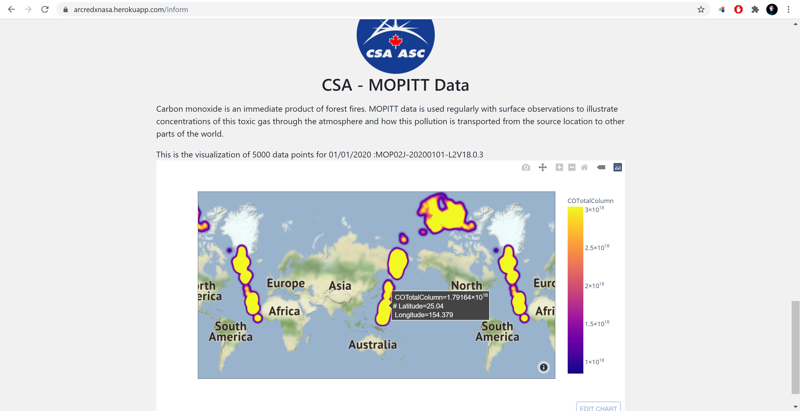
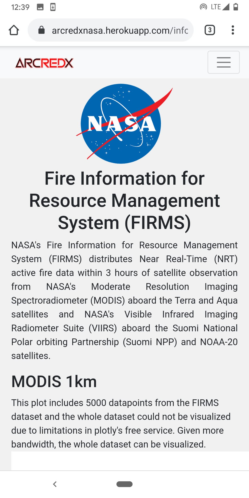
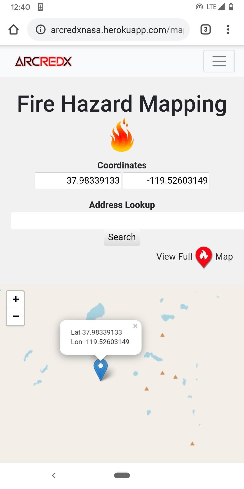
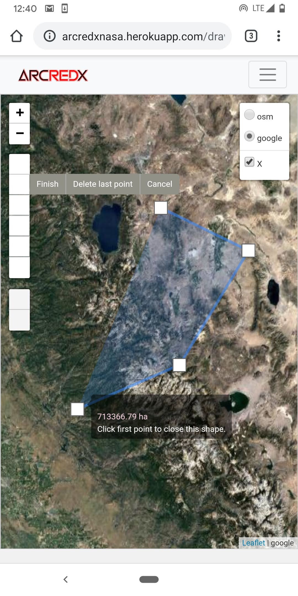

# Nasa International Space Application Challenge
### Team : [ArcredX](https://2020.spaceappschallenge.org/challenges/confront/spot-fire-3/teams/arcredx/project) | [Challenge](https://2020.spaceappschallenge.org/challenges/) - Spot The Fire v3.0 [[Details](https://2020.spaceappschallenge.org/challenges/confront/spot-fire-3/details)] | [arcredxnasa.us](https://arcredxnasa.herokuapp.com/inform)

## Solution: Live @ [https://arcredxnasa.herokuapp.com/](https://arcredxnasa.herokuapp.com/)

We propose an end-to-end platform for real time detection, prediction and awarenesss for fire hazard/ wild fires. Our solution is subdivided into 4 parts and the flow of our solution is:

`Detection:` We have 4 data sources for detection of fire and they are namely:

- <b>Satellite Data:</b> NASA {FIMRS, OpenNEX, GeoNEX} & NOAA Data, Jaxa, CSA-MOPITT and ESA Data to detect wild fires in almost real time. This is our first point of data collection of wildfires from satellite view.

- <b>Crowdsourced Data:</b> Anyone who knows of or comes across any fire hazard / smoke in a volatile/flammable area can click a picture and send it over with GPS location (latitude, longitude) to report the incident and it will be sent to the fire department(/concerned authority) and will be updated in the visualization board for others to see and be aware of the incident.  
To avoid false alarms we run an object classification CNN model on the picture and if our deep learning model detects it to be smoke/fire/fumes/burning then it will be reported otherwise discarded. 

- <b>[Future Scope] Sensor Data:</b> IOT sensors with cameras will be placed in strategic locations in wildlife sanctuaries/ national parks which will be embedded with our state of the art vision systems and infrared imaging powered by artificial intelligence/ deep learning to detect smokes and fire. The strategic locations will be found with data analysis of past data for starting point (latitude, longitude) of the wild fires.

- <b>[Future Scope] Drone Data:</b> Upon receiving early detection signals from sensors, swarms of mini drones can be deployed to particular location to map the particular area in real time.

`Prediction:`

- <b>Risk Factor [Prediction]:</b> We predict the risk factor of having wildfires due to weather phenomena into three levels - Low, Moderate and High based on Weather data and Satellite data. Factors such as Dry Season, High Aerosol, Lightning etc may lead to a natural wildfire.

- <b>Spread Direction & Severity:</b> We predict the spread direction of the wildfire based on factors such as wind, connectivity of vegetation etc. We visualize and update it real time in the map with yellow marking 🟡 around the red hotspot 🔴 of fire.

`Visualization:`

- <b>Visualizations: </b>Visualizations and seamless UI.

`Awareness and Safety:`

- <b>Awareness:</b> The map visualizes all the fire hazards 🔴 in real time with predicted spread directions 🟡, generates risk factor predictions and severity of current wildfire. If subscribed, our platform generates alerts for users within a certain range of the origin of the fire. 

- <b>Safety and Optimal Path:</b> We find the most optimal path from the current location (near wildfire) to a safety location (relief camp etc) via optimal Machine Learning Algorithms. We process mobility data of the region and give insights in the map on crowded streets, risk score etc. We also embed Augmented Reality with AR.js into our solution to help visualize directions better when people are in a state of panic (often in the case of wildfire).

### Data Points
- Fire Information for Resource Management System (FIRMS)
- FIRMS - MODIS 1km and VIIRS 375m / S-NPP & / NOAA-20
- CSA MOPITT Data
- NOAA Storms Event Location Data

🌌 Goal - Patterns in Lightning 
- Weather Data (Wind, Temperature, Humidity, Atmospheric Oxygen and Dry Climate/Season Data)
- Past Wildfires Data [ location/ time/ duration/ severity ] | [data.gov](https://www.data.gov/)
- Dataset - [NCDC Storm Events Database](https://data.nodc.noaa.gov/cgi-bin/iso?id=gov.noaa.ncdc:C00510) - [data](ftp://ftp.ncdc.noaa.gov/pub/data/swdi/stormevents/csvfiles/) | [NESDIS Hazard Mapping System Fire and Smoke Program](https://catalog.data.gov/dataset/nesdis-hazard-mapping-system-fire-and-smoke-program) | [Meteomatics](https://www.meteomatics.com/en/api/getting-started) | [Nasa EarthData - Wildfires](https://earthdata.nasa.gov/learn/toolkits/wildfires) | [Climate Data Online](https://www.ncdc.noaa.gov/cdo-web/)

### Technology Stack
- Web Application: HTML 5, CSS 3, JavaScript, TensorFlow.js, node.js
- Visualization: Plotly, Leaflet.js, chart_studio, Open Street Map & Google Maps
- Machine Learning: Python, Pandas, scikit-learn
- Augmented Reality: AR.js
- Design: Adobe Photoshop, Adobe Illustrator, Adobe Premiere

 
 
 

<h3>Interactive Satellite Data Visualization</h3>

 
 
 

<h3>Mobile View and Augmented Reality</h3>

 

 

## Problem Statement

<b>🪐 Challenge : </b>Recent wildfires worldwide have demonstrated the importance of rapid wildfire detection, mitigation, and community impact assessment analysis. Your challenge is to develop and/or augment an existing application to detect, predict, and assess the economic impacts from actual or potential wildfires by leveraging high-frequency data from a new generation of geostationary satellites, data from polar-orbiting environmental satellites, and other open-source datasets.

<b>🪐 Background : </b>In recent years, wildfire frequency, intensity, and extent, as well as economic and human health impacts, have significantly increased worldwide. Thousands of acres of land have burned, and homes, buildings, and other important community infrastructure have been destroyed by wildfires. The overall economic impacts have cost communities billions of dollars in direct damage and loss of economic productivity. 
To mitigate future losses and the overall impacts on communities, early and effective fire detection, fire prediction, risk analysis, and economic impact analysis that can provide actionable information is highly desirable. New opportunities exist for researchers and citizen scientists to convey easily consumable critical information to communities through the use of a new generation of geostationary satellites, existing polar orbiters, and many government and private sector open data initiatives. As an example, new beta geostationary satellite-based fire detection data products from NOAA are now produced and made widely available in ten minutes or less (See GOES in resources). 
In the 2018 and 2019 NASA Space Apps Challenges, the challenges called Spot That Fire versions 1.0 and 2.0 received many stimulating ideas and applications that addressed the presentation of fire detection to a general user audience. For Spot That Fire 1.0 and 2.0, geostationary data were not readily available to the public. Now they are! For Spot That Fire Version 3.0, your challenge is to propose, prototype, and present innovative ideas that use novel machine learning, data science, and data fusion for the prediction, detection and impact analysis of wildfires. 
Any processes and presentation methods that fulfill the overall challenge aim should have the potential to be rapidly deployed and executed, with the results presented to the target community in near realtime. Participants are encouraged to utilize technologies and methods including, but not limited to, open source web-based visualization and notebook packages for the execution of wildfire prediction and detection methods and processes. Participants are also encouraged to fuse appropriate open-data sources, such as county, state, or national Geographic Information Systems (GIS) parcels or boundaries, economic databases, or datasets that may aid in any impact analysis and assessments.

<b>🪐 Potential Considerations : </b>

- Prediction, detection, and/or impact assessments should be presented in a clear, intuitive, and easy-to-consume way, providing actionable information to communities, decision-makers, and/or firefighting groups. Who is your target audience
- Teams are invited (but not required to) develop or augment applications, processes, or methodologies that focus on one or more of the following suggested topics:
    - Build prototype mashups that visualize fire tracks, track predictions, or economic impacts: e.g., show fire locations, tracks and trajectories on maps, embed animations, display detailed fire data, and/or present potential impacts on infrastructure, neighborhoods, and communities, such as economic losses, costs, and overall impacts. Prototype and/or improve real-time fire detection, prediction, status monitoring, and impact analysis using novel techniques, methodologies and algorithms: i.e., using novel machine learning and data science with common open source software packages and/or web-based visualization packages.
    - Develop machine-learning training datasets for fire prediction and fire impact assessments, and provide a readily accessible and scalable application programming interface (“API”), with concise documentation, to the training dataset(s) so that other researchers within the data science or machine-learning communities can easily incorporate your training data into their own processes.
    - Build a prototype to identify major concerns: i.e., apply analytics to identify core areas or concerns with a fire and provide a mechanism to notify relevant stakeholders, e.g. using push notification, etc.
- In order to make your efforts sustainable after the Space Apps[?] event and allow the community to continue with your innovative ideas, your solution should:
    - Provide a brief description of the solution goal and design – what does it do and how?
    - Provide a description (a story) of why this solution is important and what insights or future capabilities it may provide with regard to fighting wildfires or assessing their impacts.
    - Leverage or deploy existing or novel technologies as noted in the challenge background.
    - Be an open-source project (like all Space Apps solutions).
    - Provide descriptions and links to other open-source tools used in the development (if you are building on previous Space Apps work, make sure you credit the projects).
    - Create a code repository for your project so that other people can review and/or leverage your efforts.

## Data and Resources:

API and Satellite Data - Sign Up! [OpenNex](https://opennex.org/) | [Fire Information for Resource Management System (FIRMS)](https://earthdata.nasa.gov/earth-observation-data/near-real-time/firms) | [GeoNEX](https://www.nasa.gov/geonex) - [Data Portal](https://data.nas.nasa.gov/geonex/data.php) | [Jaxa Earth Data](http://earth.jaxa.jp/en.html) | [Jaxa Wildfire Data](https://kuroshio.eorc.jaxa.jp/JASMES/index.html) | [Jaxa Wild Fire, Aerosol Optical Thickness Himawari Monitor](https://www.eorc.jaxa.jp/ptree/index.html) | [Jaxa Web-based System Using ALOS-2 to Monitor Tropical Forests On a Near Real-time Basis](https://www.eorc.jaxa.jp/jjfast/) | [JAXA satellite database related to land, sea, atmosphere, snow and sea ice, water cycle and climate fields](https://gportal.jaxa.jp/gpr/?lang=en) | [Euro Data Cube](https://www.sentinel-hub.com/spaceapps_challenge/)

Weather Data - [Meteo Matics Weather Data](https://www.meteomatics.com/en/nasa-space-apps-challenge/) - [API Query](https://www.meteomatics.com/en/api/getting-started) 

[CSA MOPPIT - ftp://data.asc-csa.gc.ca/users/OpenData_DonneesOuvertes/pub/MOPITT/ ] : Carbon monoxide is an immediate product of forest fires. MOPITT data is used regularly with surface observations to illustrate concentrations of this toxic gas through the atmosphere and how this pollution is transported from the source location to other parts of the world. 

